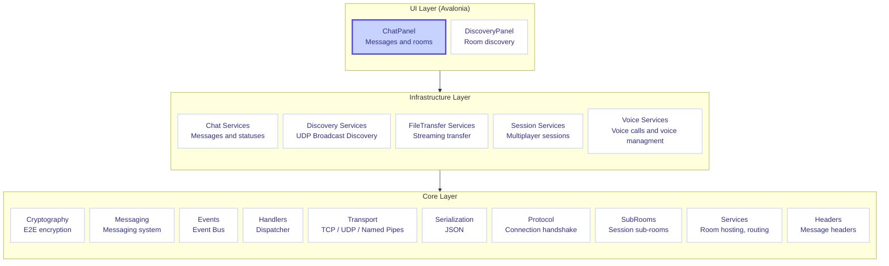
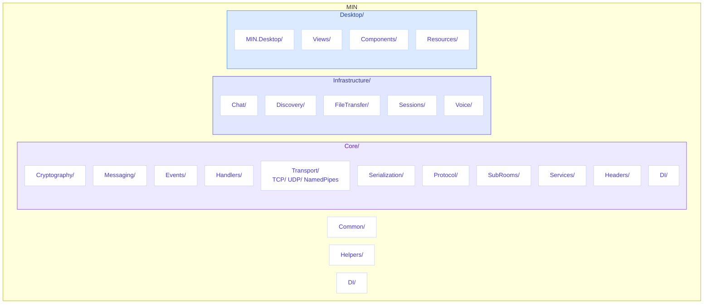
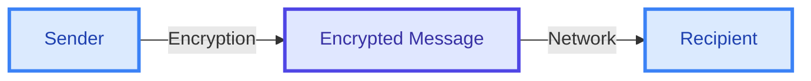
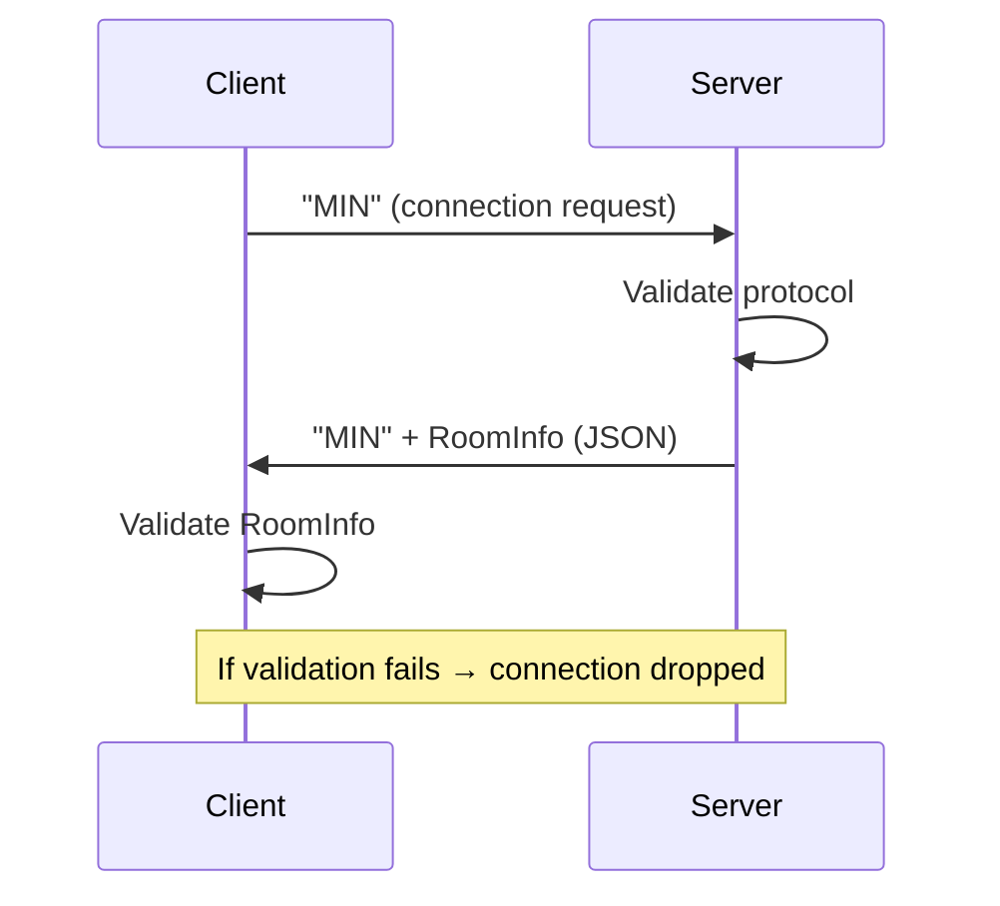
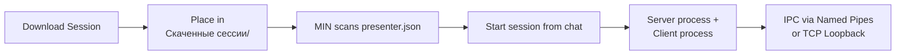

# MIN - Distributed Messenger


> **Secure distributed messenger with end-to-end encryption**

[](https://github.com/MIN-Corp/MIN/stargazers)
[](https://github.com/MIN-Corp/MIN/network/members)
[](https://github.com/MIN-Corp/MIN/blob/main/LICENSE)
[](https://dotnet.microsoft.com/)
[](https://docs.microsoft.com/en-us/dotnet/csharp/)

[English](README.md) • [Русский](README.ru.md)

---

## Contents

- [Features](#-features)
- [Architecture](#-architecture)
- [Technology Stack](#-technology-stack)
- [Installation and Running](#-installation-and-running)
- [Project Structure](#-project-structure)
- [Security](#-security)
- [Connection Protocol](#-connection-protocol)
- [Multiplayer Sessions](#-multiplayer-sessions)
- [Port Forwarding](#-port-forwarding)
- [Direct Connection](#-direct-connection)
- [Interface](#-interface)
- [Authors](#-authors)

---

## Features

| Feature | Description |
|---------|-------------|
| **End-to-End Encryption** | All messages are encrypted using cryptography |
| **File Transfer** | Sending and receiving photos and files |
| **Local Discovery** | Automatic room discovery via UDP Broadcast |
| **Direct Connection** | Connect to a room directly by IP:Port |
| **Port Forwarding** | UPnP port forwarding for non-LAN connections |
| **Connection Protocol** | Secure handshake protocol before joining a room |
| **Text Messages** | Sending and receiving messages in real time |
| **Rooms** | Creating and joining chat rooms |
| **Multiplayer Sessions** | Download and run game sessions from other resources |
| **Voice calls** | Start voice calls in room with all participants in it |
| **Desktop UI** | Intuitive interface using Avalonia |

---

## Interface

MIN provides a modern interface for:

| Function | Description |
|----------|-------------|
| **Rooms** | Creating and managing chat rooms |
| **Chat** | Real-time communication |
| **Files** | Transfer with progress display |
| **Voice calls** | Talk with your friends using room voice calls |
| **Participants** | Online/offline statuses |


---

## Architecture



### Modules

#### Core
| Module | Purpose |
|--------|---------|
| `MIN.Core.Cryptography` | Cryptographic operations |
| `MIN.Core.Messaging` | Messaging system |
| `MIN.Core.Events` | Event Bus |
| `MIN.Core.Handlers` | Handlers with dispatcher |
| `MIN.Core.Transport` | TCP / UDP / Named Pipes transport |
| `MIN.Core.Protocol` | MIN connection protocol (handshake) |
| `MIN.Core.SubRooms` | Sub-room management for sessions |
| `MIN.Core.Identity` | Local user identity |
| `MIN.Core.Services` | Room hosting, connection, routing services |
| `MIN.Core.Headers` | Message headers |
| `MIN.Core.Serialization` | JSON serialization |
| `MIN.Core.Entities` | Data models |
| `MIN.Core.Stores` | Stores |
| `MIN.Core.Streaming` | Data streams |

#### Infrastructure (Business Logic)
| Module | Purpose |
|--------|---------|
| `MIN.Chat` | Chats and messages |
| `MIN.Discovery` | Room discovery via UDP Broadcast |
| `MIN.FileTransfer` | File transfer |
| `MIN.Sessions` | Multiplayer session management |
| `MIN.Voice` | Voice calls |

#### Desktop (UI)
| Module | Purpose |
|--------|---------|
| `MIN.Desktop` | Avalonia desktop application |

#### Cross-Cutting
| Module | Purpose |
|--------|---------|
| `MIN.Common` | Common interfaces, MVC module system |
| `MIN.Helpers` | Logging, settings, versioning, updates |
| `MIN.DI` | Root dependency injection composition |

---

## Technology Stack

| Category | Technology | Description |
|----------|------------|-------------|
| Language | C# | Modern object-oriented language |
| Platform | .NET 8.0 | Cross-platform framework |
| UI | Avalonia | Cross-platform desktop interface |
| DI | Microsoft.Extensions.DependencyInjection | Dependency injection |
| Security | Microsoft.AspNetCore.DataProtection | Cross-Platform file protection |
| Transport | TCP / UDP | Network communication |
| UPnP | Open.Nat | Port forwarding for external connections |
| Voice calls | OpenAL | Cross-Platform voice recording and playback |
| Noise reduction | Onnx | Reducing background noise |
| Modularity | MIN.Common.Mvc | Custom module/plugin system |
| Style | .editorconfig | Unified code style |

---

## Installation and Running

### Requirements

> [!TIP]
> Make sure you have .NET SDK 8.0 or higher installed.

- [.NET SDK 8.0](https://dotnet.microsoft.com/download/dotnet/8.0) or higher
- Windows 10/11
- Local network (for room discovery)
- Virtual networks (Radmin, Hamachi) (if you want to connect outside local network without UPnP)

### Quick Start

```bash
# 1. Clone the repository
git clone https://github.com/MIN-Corp/MIN.git
cd MIN

# 2. Restore dependencies
dotnet restore

# 3. Build the project
dotnet build

# 4. Run the application
dotnet run --project Desktop/MIN.Desktop/MIN.Desktop.csproj
```

---

## Project Structure



> [!NOTE]
> Configuration files (`Directory.Build.props`, `Directory.Packages.props`) manage dependencies centrally.

---

## Security

> [!IMPORTANT]
> MIN uses **end-to-end encryption** — your messages are protected from interception.

### Encryption Scheme



### Security Technologies

| Technology | Purpose |
|------------|---------|
| **Asymmetric (RSA)** | Key exchange between participants |
| **Symmetric (AES)** | Message content encryption |
| **DataProtection** | Secure key storage |

---

## Connection Protocol

> [!IMPORTANT]
> Before joining a room, each client must pass the MIN protocol handshake — this ensures only compatible MIN clients can connect.



The protocol works as follows:
1. **Client** connects via TCP and sends the string `"MIN"`
2. **Server** receives the request, validates it matches the expected protocol
3. **Server** responds with `"MIN"` followed by serialized `RoomInfo` JSON containing room metadata
4. **Client** validates the response — if it doesn't start with `"MIN"` or the room info is invalid, the connection is terminated
5. Both sides use configurable timeouts to prevent hanging connections

This ensures:
- **Compatibility** — only valid MIN clients can join rooms
- **Security** — malformed or unexpected connections are rejected early
- **Metadata exchange** — clients receive room info immediately upon connection

---

## Multiplayer Sessions

MIN supports downloadable game sessions that run as separate processes alongside the messenger. These sessions enable multiplayer gaming within chat rooms.

### How Sessions Work



### How to Install a Session

1. Download the session archive from the provided link
2. Extract it into the `Скаченные сессии/` folder located next to `MIN.exe`:

```
MIN/
├── MIN.exe
├── Скаченные сессии/
│   └── MySession/
│       ├── presenter.json
│       ├── server.exe
│       ├── client.exe
│       └── thumbnail.png
```

3. Ensure the folder contains a valid `presenter.json` file at its root
4. Restart MIN or click "Rescan" — sessions will appear in the chat room

### presenter.json Format

```json
{
  "sessionId": "your_session_id",
  "name": "SessionName",
  "description": "SessionDescription",
  "version": "1.0.0",
  "serverExecutableFileName": "Name_of_server_exe_file.exe",
  "clientExecutableFileName": "Name_of_client_exe_file.exe",
  "maximumParticipants": 5,
  "thumbnailFileName": "thumbnail.png",
  "downloadLink": "https://github.com/..."
}
```

| Field | Description |
|-------|-------------|
| `sessionId` | Unique identifier for the session (must be unique among all sessions) |
| `name` | Name displayed in the UI for the session |
| `description` | Description displayed in the UI for the session |
| `version` | Version of the session (applies to both client and server) |
| `serverExecutableFileName` | Filename of the server executable |
| `clientExecutableFileName` | Filename of the client executable |
| `maximumParticipants` | Maximum number of participants (`null` = no limit) |
| `thumbnailFileName` | Thumbnail image filename (`null` = no thumbnail) |
| `downloadLink` | URL where users can download this session |

### Session Architecture

- **Server process** is started by the room host (the session communicates via IPC)
- **Client processes** connect through MIN's message routing
- Communication between MIN and session processes uses **IPC transports** (Named Pipes or TCP Loopback)
- Sessions operate within **SubRooms** — isolated sub-contexts inside a chat room
- Version compatibility is checked before joining a session

---

## Port Forwarding

> [!TIP]
> Enable port forwarding when you want participants from outside your local network to connect to your room.

MIN supports UPnP (Universal Plug and Play) port forwarding for automatic router configuration:

- **Library**: [Open.Nat](https://github.com/lontivero/Open.Nat)
- **Protocol**: UPnP
- **When creating a room**, check the **"Port Forwarding"** checkbox to enable it
- The application will attempt to discover a UPnP-enabled router and create a port mapping automatically
- If UPnP is not available on the router, the operation will fail with an explanatory message
- The public IP is resolved automatically via [api.ipify.org](https://api.ipify.org)
- Port mappings are cleaned up when the room is closed

---

## Direct Connection

You can connect to a room directly by IP address and port, bypassing local discovery. This is useful for:

- Connecting to rooms outside your local network
- Testing and debugging
- Pre-configured connections

To use direct connection:

1. Click the **"Direct Connect"** button in the Discovery panel
2. Enter the IP address and port in the format `IP:Port` (e.g., `192.168.1.100:56784`)
3. Click **Connect** — the client will attempt the MIN protocol handshake automatically

---

## Authors

| Author | Role | Contribution |
|--------|------|--------------|
| [**CasCadeVR**](https://github.com/CasCadeVR) | Founder | Lead developer, architecture creator |
| [**Karo4a**](https://github.com/Karo4a) | Inspiration | Ideas and inspiration |

---

> [!TIP]
> **Made with love by CasCade team**

*MIN — Distributed messenger*

---

[](https://github.com/MIN-Corp/MIN)
[](https://github.com/MIN-Corp/MIN)

[Source Code](https://github.com/MIN-Corp/MIN) • 
[Report an Issue](https://github.com/MIN-Corp/MIN/issues) • 
[MIT License](LICENSE)